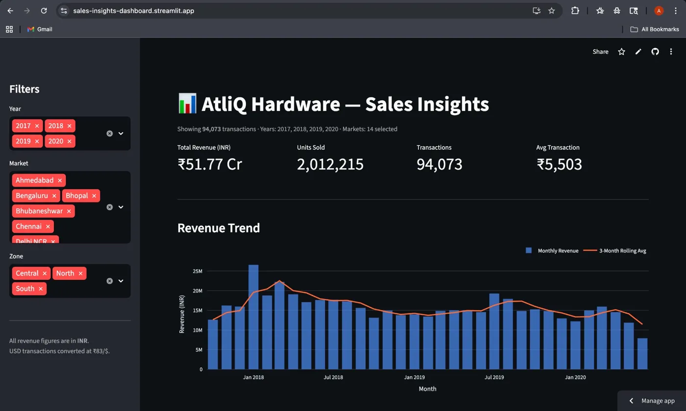
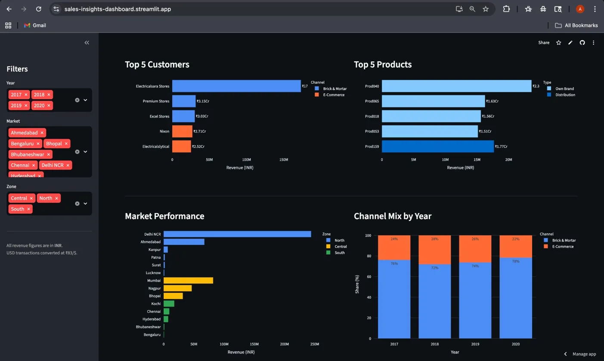
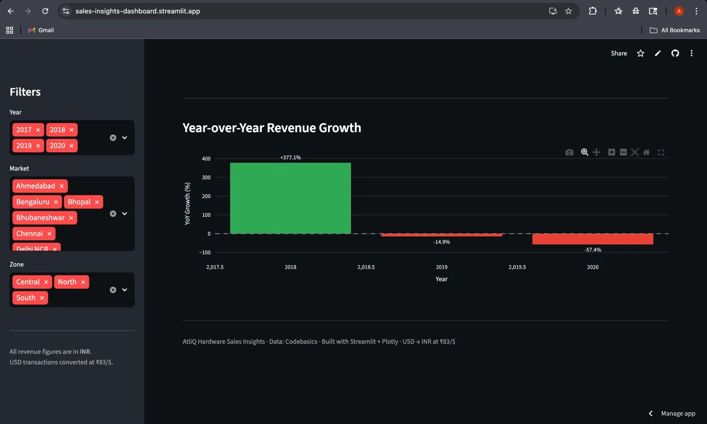

# Sales Insights Dashboard — AtliQ Hardware

[](https://sales-insights-dashboard.streamlit.app)
[](https://www.mysql.com/)
[](https://python.org)
[](https://pandas.pydata.org/)
[](https://plotly.com/)

AtliQ Hardware is a fictional computer hardware supplier selling across 15 Indian cities and 2 international markets. This project builds a unified view of their sales performance — something stakeholders previously had no easy access to. The interactive dashboard lets a business user filter by year, market, and zone and instantly see revenue trends, top customers, product performance, and channel mix — without touching SQL.

**[View live dashboard →](https://sales-insights-dashboard.streamlit.app)**

---

## Tech Stack

| Layer | Tool |
|-------|------|
| Data store | MySQL 8 (hosted on Railway) |
| Transformation | SQL view (`sales_cleaned`) |
| ETL / analysis | Python, Pandas, SQLAlchemy + PyMySQL |
| Dashboard UI | Streamlit |
| Charts | Plotly |
| Deployment | Streamlit Community Cloud |
| Fallback | Pre-exported CSV (94,073 rows, committed to repo) |

---

## Dashboard Preview

### KPIs & Revenue Trend

*Monthly revenue bars with 3-month rolling average overlay. KPI tiles show total revenue, units sold, transaction count, and average transaction value.*

### Top Customers, Products, Markets & Channel Mix

*Ranked horizontal bar charts for customers and products. Market performance coloured by zone. Stacked channel-mix bars showing Brick & Mortar vs E-Commerce split by year.*

### Year-over-Year Growth

*Green = growth, red = decline. The +377% jump in 2018 reflects a partial 2017 baseline; the -57.4% drop in 2020 aligns with COVID-era disruption (see Findings).*

---

## Key Findings

Computed from 94,073 cleaned transactions (2017–2020):

- **Total revenue:** ₹51.77 Cr across all years
- **Peak revenue year:** 2018 — ₹21.37 Cr (+377% YoY from a partial 2017 baseline)
- **Top customer:** Electricalsara Stores — ₹17.30 Cr (~33% of total revenue)
- **Top market:** Delhi NCR — ₹24.40 Cr (~47% of total revenue)
- **Top product:** Prod040 (Own Brand) — ₹2.36 Cr
- **Channel mix:** Brick & Mortar 73.9% | E-Commerce 26.1% of revenue
- **Notable trend:** Revenue peaked in 2018 then declined -14.9% in 2019 and -57.4% in 2020. The 2020 drop is consistent with COVID-19 disruption to hardware supply chains and B2B procurement, though no external data is available to confirm causation.

---

## Data Quality Issues Found

The raw dump contained 7 issues identified in [sql/02_data_quality.sql](sql/02_data_quality.sql):

| # | Issue | Fix applied in `sales_cleaned` view |
|---|-------|--------------------------------------|
| 1 | `custmer_name` — typo in column name | Aliased as `customer_name` |
| 2 | `currency` values like `'INR\r'` (Windows carriage return) | `TRIM(BOTH '\r' FROM currency)` |
| 3 | `sales_amount = -1` — sentinel rows with no valid sale | Excluded: `WHERE sales_amount > 0` |
| 4 | `sales_amount = 0` — zero-revenue rows | Excluded: `WHERE sales_amount > 0` |
| 5 | USD transactions mixed with INR | Converted at ₹83/$ in `sales_amount_inr` |
| 6 | Mark097 (New York) & Mark999 (Paris) — empty `zone` | Coalesced to `'International'` |
| 7 | Exact duplicate rows (no surrogate key) | Documented; not filtered (business rows, not errors) |

---

## Project Structure

```
sales-insights-dashboard/
├── sql/
│   ├── 01_exploration.sql       # Schema audit, row counts, FK orphan checks
│   ├── 02_data_quality.sql      # 7 data quality issues quantified
│   ├── 03_cleaned_view.sql      # sales_cleaned view: USD→INR, joins, filters
│   └── 04_kpi_queries.sql       # 10 KPI queries with window functions
├── notebooks/
│   └── analysis.ipynb           # 11-section EDA narrative + Plotly charts
├── dashboard/
│   ├── db.py                    # SQLAlchemy singleton, URL-safe credentials
│   ├── app.py                   # Streamlit dashboard (MySQL + CSV fallback)
│   └── screenshots/
│       ├── 01_overview.png      # KPIs + revenue trend
│       ├── 02_breakdowns.png    # Top customers, products, markets, channel mix
│       └── 03_yoy_growth.png    # Year-over-year growth chart
├── scripts/
│   └── export_to_csv.py         # Exports sales_cleaned → data/sales_cleaned.csv
├── docs/
│   └── findings.md              # Key business insights & design decisions
├── data/
│   ├── db_dump.sql              # Raw dump — gitignored
│   └── sales_cleaned.csv        # Pre-exported fallback (94,073 rows)
├── .env.example
├── requirements.txt
└── README.md
```

---

## Setup — Option A: Local MySQL

```bash
git clone https://github.com/akallam04/sales-insights-dashboard.git
cd sales-insights-dashboard
python -m venv .venv && source .venv/bin/activate
pip install -r requirements.txt
cp .env.example .env          # fill in DB credentials
mysql -u root -p < data/db_dump.sql
mysql -u root -p sales < sql/03_cleaned_view.sql
streamlit run dashboard/app.py
```

## Setup — Option B: CSV mode (no database needed)

The repo includes a pre-exported `data/sales_cleaned.csv` (94,073 rows).
Set `USE_CSV=1` and the dashboard reads directly from that file:

```bash
git clone https://github.com/akallam04/sales-insights-dashboard.git
cd sales-insights-dashboard
python -m venv .venv && source .venv/bin/activate
pip install -r requirements.txt
USE_CSV=1 streamlit run dashboard/app.py
```

---

## Deploying to Streamlit Community Cloud

1. Fork / push repo to GitHub.
2. Go to [share.streamlit.io](https://share.streamlit.io) → **New app** → point at `dashboard/app.py`.
3. Under **Advanced settings → Secrets**, add your DB credentials:
   ```toml
   DB_HOST     = "your-host"
   DB_PORT     = "your-port"
   DB_USER     = "root"
   DB_PASSWORD = "your-password"
   DB_NAME     = "sales"
   ```
4. If Railway free tier pauses, add `USE_CSV = "1"` to secrets — the app falls back to the committed CSV automatically.

---

## Design Decisions & Trade-offs

- **Why a view instead of a staging table?** All cleaning logic lives in `sales_cleaned` — any fix propagates to every query and to the dashboard automatically, with no ETL re-run required.
- **Biggest data quality find:** `'INR\r'` — Windows carriage returns embedded in the currency column, invisible in most editors. Caught via `LENGTH(currency) = 4` (should be 3) in the quality audit.
- **Window functions used:** `LAG()` for YoY growth, `SUM() OVER (PARTITION BY year)` for within-year channel share, `ROWS BETWEEN UNBOUNDED PRECEDING AND CURRENT ROW` for cumulative YTD revenue.
- **USD conversion at a fixed rate:** ₹83/$ is a representative 2020 average. A production system would join a daily FX rate table — documented as a known limitation.
- **CSV fallback:** The committed CSV means the live demo never breaks when Railway's free tier pauses — important for a portfolio project viewed asynchronously by recruiters.
- **What I'd add with more time:** Prophet time-series forecasting on the monthly trend, RFM-based customer segmentation, dbt for the transformation layer.
